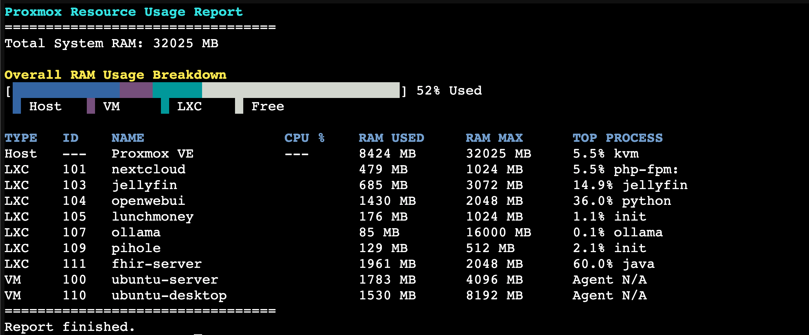

# proxmox-ram-monitor

This repository contains a bash script to monitor **RAM and CPU usage** in Proxmox across the **host**, **LXC containers**, and **QEMU/KVM virtual machines**.



The script provides:
- A **composite usage bar** showing host, VM, and LXC memory usage.
- A **detailed table** listing each instance with CPU%, RAM usage, max RAM, and top memory-consuming process.
- Clear **color-coded output** for quick insight.

---

## 📜 Script

The monitoring script is located at:

```
proxmox-ram-monitor.sh
```

### Features:
- Works with both **cgroup v1** and **cgroup v2** memory tracking.
- Collects memory and CPU usage for:
  - **Host system**
  - **Running LXC containers**
  - **Running QEMU/KVM virtual machines**
- Displays the **top memory-consuming process** for each environment.
- Visual **progress bars** for memory breakdown.

---

## ▶️ How to Run

Clone this repository and run the script as root:

```bash
git clone https://github.com/micklynch/proxmox-ram-monitor.git
cd proxmox-ram-monitor
sudo bash proxmox-ram-monitor.sh
```

⚠️ The script must be run as **root** to access system information.

---

## 📊 Example Output

Below is a sample screenshot of the script in action:


---

## ✅ Requirements

- Proxmox host with:
  - `pct` (for LXC monitoring)
  - `qm` (for QEMU/KVM monitoring)
- Bash shell
- Root privileges
